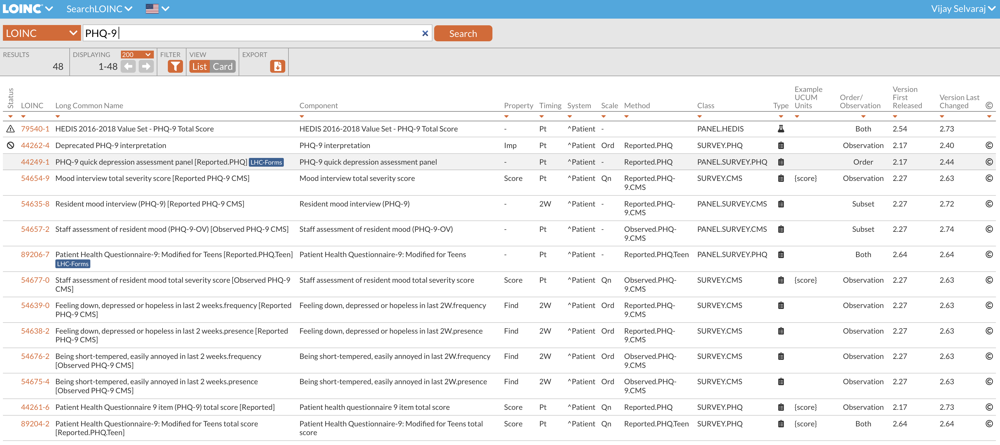

# TLDR; FHIR for Data Science

* **FHIR is a global standard for exchanging healthcare information electronically.**
* **Highly extensible and flexible.**
* **Clinical and Genomic data can be exchanged using FHIR.**

### Data Science and FHIR

Work directly with raw data from FHIR servers and in a way that is globally interoperable.

### Python for FHIR:
```commandline
pip install fhir.resources
```

```python
# https://pypi.org/project/fhir.resources

from fhir.resources.organization import Organization
from fhir.resources.address import Address

data = {
    "id": "f001",
    "active": True,
    "name": "Acme Corporation",
    "address": [{"country": "Switzerland"}]
}

org = Organization(**data)
org.resource_type == "Organization"  # True


# Load from a JSON String
json_str = '''{"resourceType": "Organization",
    "id": "f001",
    "active": True,
    "name": "Acme Corporation",
    "address": [{"country": "Switzerland"}]
}'''

org = Organization.parse_raw(json_str)
isinstance(org.address[0], Address) # True
org.address[0].country == "Switzerland" # True
org.dict()['active'] is True # True
```


Examples

Uncompress the fhir-resources.zip file and run the following commands:

```commandline
python3 -m venv .venv
source .venv/bin/activate
pip install fhir.resources

python example-01.py   # runs the sample code
```


# What is FHIR
### **Standardized Data Format:** 
FHIR (Fast Healthcare Interoperability Resources) is a set of standards designed to enable healthcare information to be available, discoverable, and understandable globally, and to support a wide range of applications, including electronic health records (EHRs), data exchange between healthcare providers, and patient-centric services.
### **Resource-Based Approach:** 
It utilizes a resource-based framework, where each resource (such as a patient, observation, or diagnostic report) is defined by a set of data elements and a standardized structure, making it easier for developers and data scientists to build and integrate healthcare applications.
### **Interoperability and Integration:** 
FHIR is specifically aimed at improving interoperability between disparate systems and facilitating more effective and seamless data exchange. It supports RESTful architectures, making it compatible with modern web technologies and enabling straightforward integration with existing healthcare IT ecosystems.

# Why FHIR matters for Data Scientists?

### **Facilitates Data Access:** 
FHIR enables easier access to a wide array of healthcare data, crucial for building accurate and robust data models that can drive insights and innovation in healthcare.

### **Ensures Data Standardization:** 
Understanding FHIR is key for data scientists to work with standardized data formats, improving data quality and compatibility across systems, which is essential for reliable analytics and machine learning applications.

### **Supports Advanced Analytics:** 
Knowledge of FHIR allows data scientists to more effectively integrate and analyze healthcare data from diverse sources, enabling the development of advanced predictive models and personalized medicine approaches.

# FHIR Core Concepts

### Resources


```json
{
  "resourceType": "Patient",
  "id": "example-patient-01",
  "meta": {
    "versionId": "1",
    "lastUpdated": "2024-02-04T09:00:00Z",
    "profile": [
      "http://hl7.org/fhir/Patient"
    ]
  },
  "text": {
    "status": "generated",
    "div": "<div xmlns=\"http://www.w3.org/1999/xhtml\">Sample Patient Resource</div>"
  },
  "identifier": [
    {
      "use": "official",
      "type": {
        "coding": [
          {
            "system": "http://terminology.hl7.org/CodeSystem/v2-0203",
            "code": "MR",
            "display": "Medical Record Number"
          }
        ]
      },
      "system": "https://www.hospital.com/patients",
      "value": "123456"
    }
  ],
  "active": true,
  "name": [
    {
      "use": "official",
      "family": "Doe",
      "given": [
        "John",
        "Alexander"
      ]
    }
  ],
  "telecom": [
    {
      "system": "phone",
      "value": "555-123-4567",
      "use": "mobile"
    },
    {
      "system": "email",
      "value": "john.doe@example.com",
      "use": "home"
    }
  ],
  "gender": "male",
  "birthDate": "1980-04-12",
  "address": [
    {
      "use": "home",
      "line": [
        "123 Main St",
        "Apartment 4"
      ],
      "city": "Anytown",
      "state": "Anystate",
      "postalCode": "12345",
      "country": "USA"
    }
  ],
  "maritalStatus": {
    "coding": [
      {
        "system": "http://terminology.hl7.org/CodeSystem/v3-MaritalStatus",
        "code": "M",
        "display": "Married"
      }
    ]
  },
  "contact": [
    {
      "relationship": [
        {
          "coding": [
            {
              "system": "http://terminology.hl7.org/CodeSystem/v2-0131",
              "code": "N",
              "display": "Next of Kin"
            }
          ]
        }
      ],
      "name": {
        "family": "Doe",
        "given": [
          "Jane"
        ]
      },
      "telecom": [
        {
          "system": "phone",
          "value": "555-987-6543",
          "use": "home"
        }
      ],
      "address": {
        "use": "home",
        "line": [
          "123 Main St"
        ],
        "city": "Anytown",
        "state": "Anystate",
        "postalCode": "12345",
        "country": "USA"
      }
    }
  ],
  "communication": [
    {
      "language": {
        "coding": [
          {
            "system": "http://hl7.org/fhir/ValueSet/languages",
            "code": "en-US",
            "display": "English (United States)"
          }
        ]
      },
      "preferred": true
    }
  ]
}
```

### Extensions 

Example of adding an extension to a Patient resource to capture additional details

```json
{
  "resourceType": "Patient",
  "id": "example-patient-02",
  "extension": [
    {
      "url": "http://example.org/fhir/StructureDefinition/extended-gender",
      "valueCodeableConcept": {
        "coding": [
          {
            "system": "http://example.org/fhir/CodeSystem/gender-identity",
            "code": "cisgender",
            "display": "Cisgender"
          }
        ]
      }
    }
  ],
  "gender": "other",
  "name": [
    {
      "use": "official",
      "family": "Smith",
      "given": [
        "Jordan"
      ]
    }
  ],
  // Other patient details...
}
```

### FHIR Codes
* Standardized coding systems are used to represent data in FHIR resources
* https://loinc.org/ - commonly used coding system



## FHIR and Data Science

### Data Collection
* FHIR server REST API: /{FHIR Resource}/{identifier}

### Data Analysis
* Python library to extract objects from FHIR resources: `fhir.resources`

### Real-world Applications
* Depression classification
* Image processing
* Genomic data analysis