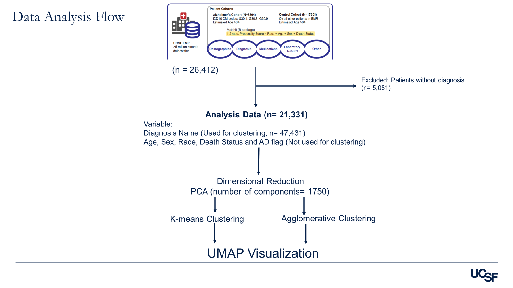
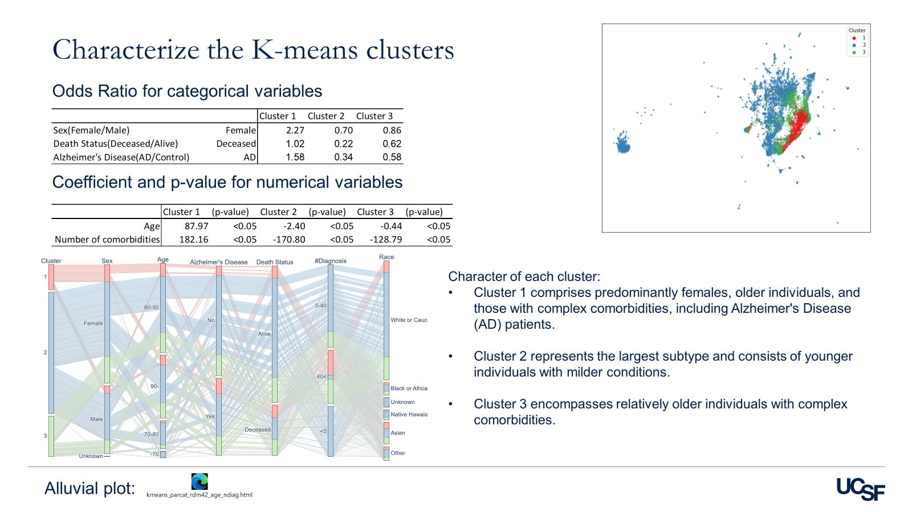
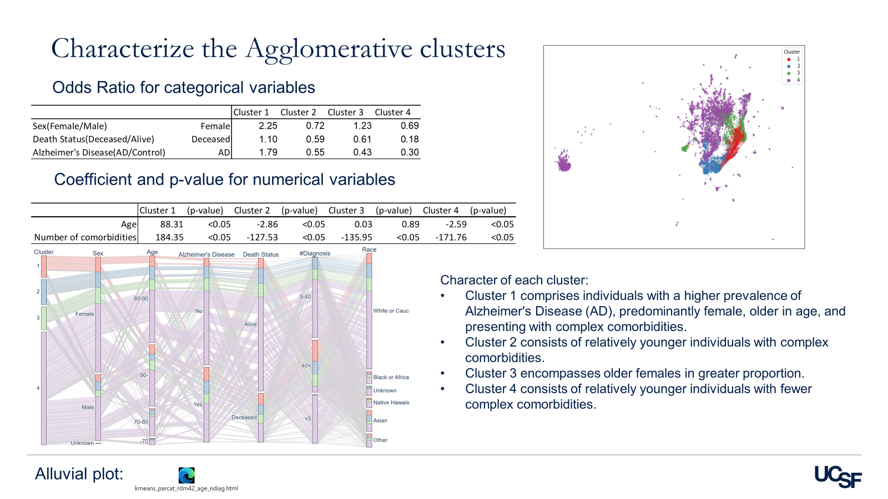

# Final Project

# List of collablrators
NA

# How to run
1. Open the all notebooks
    1. 1.DimentionalReduction_PCA.ipynb (https://github.com/yukarikatsuhara/datasci_223/blob/main/exercises/5-Final/1.DimentionalReduction_PCA.ipynb)
    2. 2-1.Kmeans_Clustering_Classical.ipynb (https://github.com/yukarikatsuhara/datasci_223/blob/main/exercises/5-Final/2-1.Kmeans_Clustering_Classical.ipynb)
    3. 2-2.Kmeans_Clustering_iterative.ipynb (https://github.com/yukarikatsuhara/datasci_223/blob/main/exercises/5-Final/2-2.Kmeans_Clustering_iterative.ipynb)
    4. 2-3.Kmeans_Characterize_Clusters.ipynb (https://github.com/yukarikatsuhara/datasci_223/blob/main/exercises/5-Final/2-3.Kmeans_Characterize_Clusters.ipynb)
    5. 3-1.Agglomerative_Clustering_Classical.ipynb (https://github.com/yukarikatsuhara/datasci_223/blob/main/exercises/5-Final/3-1.Agglomerative_Clustering_Classical.ipynb)
    6. 3-2.Agglomerative_Clustering_iterative.ipynb (https://github.com/yukarikatsuhara/datasci_223/blob/main/exercises/5-Final/3-2.Agglomerative_Clustering_iterative.ipynb)
    7. 3-3.Agglomerative_Characterize_Clusters.ipynb (https://github.com/yukarikatsuhara/datasci_223/blob/main/exercises/5-Final/3-3.Agglomerative_Characterize_Clusters.ipynb)

2. Clear outputs (if any)
3. Run all in the above order in a fresh virtual enviroment (no dependencies other than jupyter)

- Documentation:
    - Overview of the problem
    - Description of the dataset you used (input features, outcome, dimensions, etc)
    - How to run the code (dependencies, etc.)
    - Decisions made along the way, including trade-offs (e.g., cut X for time so our solution may lack Y)
    - Example output (what does it do?)
    - Citations (data, code, papers)

# Overview of this project
**Purpose:** This project will involve exploring clustering approaches to better understand AD heterogeneity in the EMR, and ultimately derive insights into heterogeneity in this population due to both clinical care and potential biotypes in AD.

**Dataset**
The dataset that was extracted for my mentor's research is used for this study.
The detailed extraction process is cited from my mentor's paper:
All analysis of UCSF EMR data was performed. All clinical data were deidentifiedand written informed consent was waived by the institutions.
Patient cohorts were identified from over five million patients in the UCSF EMR database, which includes clinical data from 1982 to 2020. Due to the de-identification process, dates are shifted by at most a year (with relative dates preserved) and all birth dates before 1930 (=estimated age 90)
are shifted to be no earlier than 1930. Patients with AD were identified by inclusion criteria of estimated age >64 years, and ICD-10-CM codes G30.1, G30.8, or G30.9, where estimated age is determined from the birth date. Male and female groups were identified by the most recent sex assignment in the EMR. To identify a control group, we used propensity score (PS) matching method (matchit R package115) by a logistic regression model to match controls to patients with AD. The control group was selected from patients >64 years old without AD diagnosis, matched on
sex, estimated age, race, and death status at a 1:2 AD:control ratio using a nearest neighbors method.

**Methods**
1. Dimentional Reduction by PCA (notebook: (https://github.com/yukarikatsuhara/datasci_223/blob/main/exercises/5-Final/1.DimentionalReduction_PCA.ipynb))
According to cumulative explained variance ratio, 1750 components are chosen as the variables for the next clustering approach.
2. K-means clustering: To visualize high dimentional clusters in low dimentional space, UMAP visualization is conducted.
    1. Classical clustering (notebook: (https://github.com/yukarikatsuhara/datasci_223/blob/main/exercises/5-Final/2-1.Kmeans_Clustering_Classical.ipynb))
    2. Iterative clustering (notebook: (https://github.com/yukarikatsuhara/datasci_223/blob/main/exercises/5-Final/2-2.Kmeans_Clustering_iterative.ipynb))
    3. Characterize each cluster (notebook: (https://github.com/yukarikatsuhara/datasci_223/blob/main/exercises/5-Final/2-3.Kmeans_Characterize_Clusters.ipynb))
3. Agglomerative clustering
    1. Classical clustering (notebook: (https://github.com/yukarikatsuhara/datasci_223/blob/main/exercises/5-Final/3-1.Agglomerative_Clustering_Classical.ipynb))
    2. Iterative clustering (notebook: (https://github.com/yukarikatsuhara/datasci_223/blob/main/exercises/5-Final/3-2.Agglomerative_Clustering_iterative.ipynb))
    3. Characterize each cluster (notebook: (https://github.com/yukarikatsuhara/datasci_223/blob/main/exercises/5-Final/3-3.Agglomerative_Characterize_Clusters.ipynb))

Data Analysis Flow

**Example output**

**Citations**
Tang AS, Oskotsky T, Havaldar S, Mantyh WG, Bicak M, Solsberg CW, Woldemariam S, Zeng B, Hu Z, Oskotsky B, Dubal D, Allen IE, Glicksberg BS, Sirota M. Deep phenotyping of Alzheimer's disease leveraging electronic medical records identifies sex-specific clinical associations. Nat Commun. 2022 Feb 3;13(1):675. doi: 10.1038/s41467-022-28273-0. PMID: 35115528; PMCID: PMC8814236.
